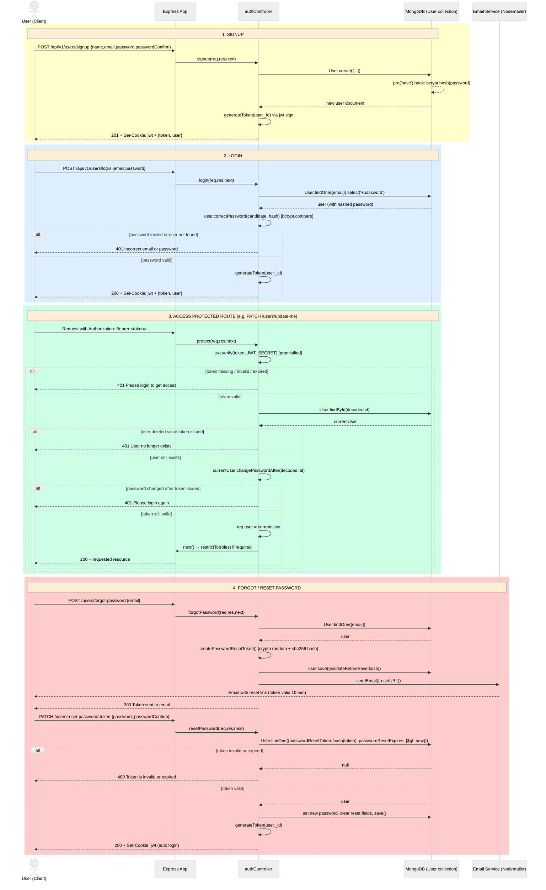

# Tour Booking API </>

This is a **RESTful API** for a Tour Booking application, allowing users to browse tours, book trips, leave reviews, and manage their accounts. The API is built using **Node.js** and **Express**, with MongoDB as the database.

## Features

- **User Authentication** (Sign up, Login, Forgot Password, etc.)
- **Tour Management** (List, Filter, and Get Tour Details)
- **Booking System** (Book and Manage Reservations)
- **Reviews and Ratings**
- **Geolocation:** Get distances to tours from a given location.
- **Email Notifications:** Automated emails for booking confirmation and password resets.

## API Documentation

For a complete list of available endpoints and request examples, visit the **Postman API Documentation:**  
👉 [API Documentation](https://documenter.getpostman.com/view/37294382/2sAYkKHHhd)

## User Authentication Flow



## Application Flow Diagram

```mermaid
    ---
config:
  theme: base
  themeVariables:
    background: "#ffffff"
    primaryTextColor: "#000000"
    lineColor: "#000000"
    textColor: "#000000"
    clusterBkg: "#ffffff"
    clusterBorder: "#000000"
---
flowchart TB
    Client["Client Apps<br/>(Postman / React Frontend / Mobile)"]
    Razorpay["Razorpay<br/>(Payment Gateway)"]

    subgraph Server["Node.js + Express Server (server.js / app.js)"]
        direction TB

        subgraph MW["Global Middleware Pipeline"]
            direction TB
            Helmet["helmet<br/>(secure HTTP headers)"]
            RateLimit["express-rate-limit<br/>(100 req/hr per IP on /api)"]
            WebhookRoute["POST /api/v1/webhook-razorpay<br/>(express.raw, registered BEFORE<br/>json parser for signature check)"]
            BodyParser["express.json<br/>(body parsing, 10kb limit)"]
            Sanitize["express-mongo-sanitize + xss-clean<br/>(NoSQL injection / XSS defense)"]
            HPP["hpp<br/>(param pollution guard)"]
            Static["express.static<br/>(serves /public)"]
            Helmet --> RateLimit --> WebhookRoute --> BodyParser --> Sanitize --> HPP --> Static
        end

        subgraph Routers["Routers (/api/v1/*)"]
            direction TB
            TourRouter["tourRouter"]
            UserRouter["userRouter"]
            ReviewRouter["reviewRouter"]
            BookingRouter["bookingRouter<br/>(checkout-session, verify-payment,<br/>my-bookings, admin CRUD)"]
            TourRouter -. "nested: /:tourId/reviews" .-> ReviewRouter
        end

        subgraph Auth["Auth Middleware (authController)"]
            direction TB
            Protect["protect<br/>(verify JWT, attach req.user)"]
            Restrict["restrictTo(...roles)<br/>(role-based access control)"]
            Protect --> Restrict
        end

        subgraph Controllers["Controllers"]
            direction TB
            TourCtrl["tourController<br/>(aliasTopTours, geo queries,<br/>aggregations)"]
            UserCtrl["userController<br/>(getMe, updateMe, deleteMe)"]
            ReviewCtrl["reviewController<br/>(setTourUserIds)"]
            AuthCtrl["authController<br/>(signup, login, forgot/reset<br/>password, updatePassword)"]
            BookingCtrl["bookingController<br/>(checkoutSession, verifyPaymentAndBook,<br/>razorpayWebhook, getMyBookings)"]
            Factory["handleFactory<br/>(generic createOne/getAll/<br/>getOne/updateOne/deleteOne)"]

            TourCtrl -. uses .-> Factory
            UserCtrl -. uses .-> Factory
            ReviewCtrl -. uses .-> Factory
            BookingCtrl -. uses .-> Factory
        end

        subgraph Utils["Cross-cutting Utils"]
            direction TB
            APIFeatures["APIFeatures<br/>(filter/sort/limit/paginate)"]
            AppError["AppError"]
            CatchAsync["catchAsync<br/>(async error wrapper)"]
            ErrorHandler["globalErrorHandler<br/>(errors.js)"]
            Email["email.js<br/>(nodemailer)"]
            SignatureUtil["verifyRazorpaySignature<br/>(HMAC SHA256 check)"]
        end

        subgraph Models["Mongoose Models"]
            direction TB
            TourModel["Tour<br/>(geo index, slug,<br/>virtual populate: reviews)"]
            UserModel["User<br/>(bcrypt hash, password reset<br/>token, active flag)"]
            ReviewModel["Review<br/>(unique tour+user index,<br/>post-save avgRating calc)"]
            BookingModel["Booking<br/>(unique+sparse razorpayPaymentId,<br/>paid flag, tour+user refs)"]
        end
    end

    DB[("MongoDB Atlas<br/>(Tours / Users / Reviews / Bookings)")]
    SMTP["Email Service<br/>(SMTP via nodemailer)"]

    Client -->|HTTPS request| MW
    MW --> Routers
    Routers -->|protected routes| Auth
    Routers -->|public routes| Controllers
    Auth --> Controllers
    Controllers --> Utils
    Controllers --> Models
    Models -->|Mongoose ODM| DB
    AuthCtrl -->|password reset /<br/>welcome email| Email
    Email --> SMTP
    Controllers -. errors .-> ErrorHandler
    ErrorHandler -->|JSON error response| Client
    Controllers -->|JSON success response| Client
    BookingCtrl -->|create order / verify signature| Razorpay
    BookingCtrl -. uses .-> SignatureUtil
    Razorpay -.->|signed webhook payload,<br/>bypasses Client + Auth| WebhookRoute
    WebhookRoute -->|payment.captured event| BookingCtrl

    classDef default fill:#ffffff,stroke:#000000,color:#000000,stroke-width:2px;
    classDef external fill:#e6f0ff,stroke:#003b8f,color:#000000,stroke-width:3px;
    classDef db fill:#fff4cc,stroke:#7a4f00,color:#000000,stroke-width:3px;
    classDef payment fill:#ffe0e0,stroke:#990000,color:#000000,stroke-width:3px;
    classDef server fill:#f2f2f2,stroke:#000000,color:#000000,stroke-width:2px;
    classDef middleware fill:#e6f7f5,stroke:#005a55,color:#000000,stroke-width:2px;
    classDef auth fill:#eee8ff,stroke:#3b1f7a,color:#000000,stroke-width:2px;
    classDef controller fill:#e8f1ff,stroke:#003b8f,color:#000000,stroke-width:2px;
    classDef utility fill:#fff0d9,stroke:#7a3e00,color:#000000,stroke-width:2px;
    classDef model fill:#e8f7e8,stroke:#145214,color:#000000,stroke-width:2px;

    class Client,SMTP external;
    class DB db;
    class Razorpay payment;
    class Server server;
    class Helmet,RateLimit,WebhookRoute,BodyParser,Sanitize,HPP,Static middleware;
    class Protect,Restrict auth;
    class TourCtrl,UserCtrl,ReviewCtrl,AuthCtrl,BookingCtrl,Factory controller;
    class APIFeatures,AppError,CatchAsync,ErrorHandler,Email,SignatureUtil utility;
    class TourModel,UserModel,ReviewModel,BookingModel model;

    linkStyle default stroke:#000000,stroke-width:2px;

```



## Installation

### **1. Clone the repository**

```sh
git clone https://github.com/YogeshMahajanGit/Natours-API.git
cd Natours-API
```

### **2. Install dependencies**

```sh
npm install
```

### **3. Configure environment variables**

Create a `.env` file in the project root and add the following:

```env
NODE_ENV=development or production
PORT=5000
DATABASE_CONNECT_URL=your_mongodb_connection_string
JWT_SECRET=your_jwt_secret_key
JWT_EXPIRES_IN=20d
JWT_COOKIE_EXPIRES_IN=20
EMAIL_USERNAME=your_email_username
EMAIL_PASSWORD=your_email_password
EMAIL_HOST=your_email_host
EMAIL_PORT=your_email_port

RAZORPAY_KEY_ID=
RAZORPAY_KEY_SECRET=
```

### **4. Start the server**

```sh
npm start
```

For development mode with live reload:

```sh
npm run dev
```

## **5. Running Tests**

```sh
npm test
```

Tests use `mongodb-memory-server` for an isolated in-memory database and Supertest for HTTP integration testing.

[](https://github.com/YogeshMahajanGit/Natours-API/actions/workflows/test.yaml)

## Deployment

To deploy the API, set up the `.env` variables and use a hosting service like **Vercel, Render, or AWS**.

## Technologies Used


- **Node.js & Express** (Backend Framework)
- **MongoDB & Mongoose** (Database & ORM)
- **JWT & Bcrypt** (Authentication & Security)
- **Nodemailer** (Email Services)
- **Jest/Supertest**(Testing)

## Contact

For any inquiries, reach out via email: **mahajanyogesh443@gmail.com**

---

🚀 **Happy Coding!** If you like this project, don't forget to ⭐ the repo!
